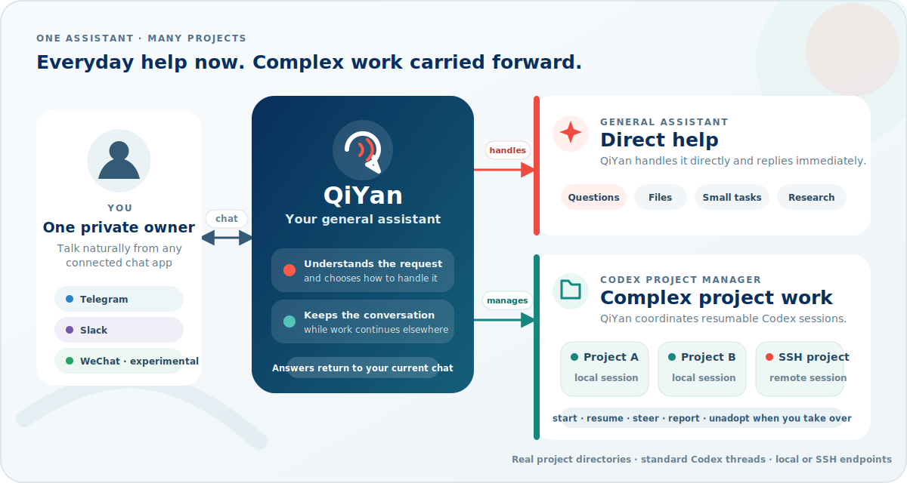

# QiYan Bot

<p align="center">
  
</p>

QiYan Bot is a single-user, self-hosted, general-purpose personal assistant powered by Codex. It can answer and handle small filesystem tasks directly, or deliberately delegate sustained project work to ordinary, resumable Codex sessions. Telegram and Slack are implemented and live-tested. Personal WeChat is experimental: it is implemented with automated-test coverage but has not been successfully live-tested. Telegram, Slack, and WeChat can run together behind the same transport-neutral backend.

## One assistant, many project sessions

> **QiYan is both your everyday assistant and your Codex project manager.** It handles questions, files, and small tasks directly. For sustained or complex work, it starts or resumes the right Codex session, keeps it attached to its real project directory, and helps you steer and track the work from chat.

<p align="center">
  
</p>

Each managed project remains an ordinary, resumable Codex session in its own project directory. You can unadopt it from QiYan, continue it directly with Codex, and adopt it again later without creating a separate worker format.

QiYan keeps the assistant and project workers distinct. The assistant has its own HOME, CODEX_HOME, authentication, instructions, and app-server. Workers use your normal HOME, CODEX_HOME, configuration, credentials, skills, and app-server. If another Codex client starts a turn in a managed thread, QiYan fences its own dispatch, warns you, and automatically unadopts the session once the external turn is idle. For a planned handoff, you can still call `unadopt_session` first to avoid the temporary release-pending window; adopt it again later if QiYan should resume management.

## Security model

Read this before installing or launching:

- The assistant defaults to `danger-full-access` with approval policy `never`. It can read, write, and execute as your OS user without an interactive confirmation.
- Chat approvals are unsupported. Worker sessions receive no QiYan approval, sandbox, or shell override, so your normal Codex configuration must already be suitable for automatic, non-interactive operation. A remaining permission request is reported as blocked.
- The Telegram adapter accepts only the configured owner and sends only to that owner's private chat. This is not a multi-user service.
- The Slack adapter accepts only the configured owner. Its `xoxp-` user token is read-only by QiYan's code boundary but remains a powerful credential whose search coverage follows the owner's Slack permissions and workspace policy.
- The experimental personal WeChat adapter has not been successfully live-tested. It accepts only the owner authenticated by `weixin-login`; groups, history/search, untranscribed raw voice, and raw video are unsupported.
- The private `.env` is not propagated to assistant or worker child processes, but full filesystem access under the same OS user means QiYan can technically read it. Filesystem isolation requires a dedicated account or container.
- Use a dedicated OS account or container if other same-account processes are outside your trust boundary.

## Requirements

- Linux
- Node.js 24 or newer
- `codex-cli 0.142.5` or newer
- For remote workers: OpenSSH client; the remote Linux host needs Node.js 24+, tmux, Codex 0.142.5+, and its own authenticated Codex profile
- At least one chat adapter: Telegram owner credentials, Slack owner/workspace credentials, a managed personal WeChat login, or any combination

## Install

QiYan is distributed through GitHub Releases, not the npm registry. Install the latest release directly:

```bash
npm install --global --prefix "$HOME/.local" https://github.com/O123O/qiyan-bot/releases/latest/download/qiyan-bot.tgz
export PATH="$HOME/.local/bin:$PATH"
qiyan-bot --version
```

The Release archive is a bundled runtime with no production dependency tree. For manual digest verification and a no-Git source build, see the [installation guide](docs/installation.md).

Setup guides:

- [Shared Codex and assistant setup](docs/setup.md)
- [Required fresh cutover for versions before v0.3.0](docs/upgrading-to-v0.3.md)
- [Telegram — implemented](docs/chat-apps/telegram.md)
- [Slack — implemented](docs/chat-apps/slack.md)
- [Personal WeChat — experimental](docs/chat-apps/wechat.md)
- [SSH worker endpoints](docs/ssh-workers.md)

## Configure and run

The normal configuration lives in `~/.qiyan-bot/.env`. Create it as an owner-only file (replace the placeholders; never commit this file):

```bash
mkdir -p "$HOME/.qiyan-bot"
chmod 700 "$HOME/.qiyan-bot"
cat > "$HOME/.qiyan-bot/.env" <<'EOF'
TELEGRAM_BOT_TOKEN=replace-with-botfather-token
TELEGRAM_OWNER_ID=123456789
TELEGRAM_DESTINATION_CHAT_ID=123456789
EOF
chmod 600 "$HOME/.qiyan-bot/.env"
```

This is a Telegram example. Slack dotenv setup is in the [Slack guide](docs/chat-apps/slack.md); personal WeChat uses the managed credential created by `qiyan-bot weixin-login`, never an environment token. At least one adapter is required. When multiple adapters are configured, `PRIMARY_CHAT_APP` must be `telegram`, `slack`, or `weixin`. Validate the complete configuration, then authenticate the isolated assistant profile once:

```bash
qiyan-bot config-check
qiyan-bot assistant-login
```

This does not copy or link normal Codex authentication. The assistant starts in `<QIYAN_HOME>/qiyan-workdir`; it does not use the repository or launch directory as user workspace.

Before launching, remember that the assistant is non-interactive `danger-full-access`, while workers must be configured in your normal Codex profile for automatic operation because chat approvals are unsupported.

```bash
qiyan-bot
```

QiYan deliberately runs as a long-lived foreground process; it does not daemonize itself. Successful startup prints a readiness line and keeps the terminal occupied until Ctrl+C, SIGINT, or SIGTERM. Use a process supervisor such as a user systemd service for unattended operation.

On a systemd-based Linux desktop or server, install and start QiYan as an enabled user service after configuration and assistant login:

```bash
qiyan-bot service install
qiyan-bot service status
qiyan-bot service logs
```

The service supervises the same foreground process, so tmux is unnecessary. Other lifecycle actions are `start`, `stop`, `restart`, and `uninstall`. `service status` always points to `service logs`, which reads the latest 100 journal entries even if a stale service-operation lock exists. Runtime journal events report adapter startup, accepted or safely ignored input, assistant turn submission and completion, polling and reconnect failures or recovery, delivery failures, and contained background failures. These events contain bounded metadata only—never message bodies, attachment contents, tokens, or Codex credentials.

`qiyan-bot service install` captures the invoking terminal's exact `PATH` in the managed unit so service mode can find the same executables as a foreground launch. Run it from a normally initialized terminal. Systemd does not source `config.fish`, `.bashrc`, or other shell startup files. If your PATH changes, refresh the snapshot with `qiyan-bot service uninstall` followed by `qiyan-bot service install`; restarting alone keeps the old PATH. The unit contains the captured non-secret PATH plus absolute executable/state paths, while credentials remain in the private `.env` and are never copied into the unit. Installation validates this service-effective configuration rather than temporary shell-only bot variables. An existing unit not marked as QiYan-managed is never overwritten or removed. See the [shared setup guide](docs/setup.md) for user-service path, lingering, and recovery details.

QiYan home is selected by CLI `--home`, then process `QIYAN_HOME`, then `$HOME/.qiyan-bot`. Other settings use CLI, then process environment, then `<QIYAN_HOME>/.env`, then defaults. `QIYAN_HOME` itself is intentionally not allowed inside `.env`.

The defaults are:

- QiYan home: `$HOME/.qiyan-bot`
- assistant workdir: `$HOME/.qiyan-bot/qiyan-workdir`
- data and isolated profile: `$HOME/.qiyan-bot/data`
- session registry: `$HOME/.qiyan-bot/data/sessions.json`
- delegated fallback root: `$HOME/qiyan-projects`

`qiyan-bot --home /private/qiyan`, `--workdir`, `ASSISTANT_WORKDIR`, `DATA_DIR`, `SESSION_REGISTRY_PATH`, and `ASSISTANT_SANDBOX_MODE` override those defaults independently. Use absolute paths for a service. Keep the same home for `config-check`, `assistant-login`, and run. The assistant sandbox override affects only the assistant; it never changes worker policy.

## Direct work and delegated sessions

QiYan reads `assistant-context.json` to translate phrases such as “my Documents” to your real home, because the assistant's shell `~` points to its isolated HOME. Small, personal, one-off, and cross-project tasks are normally done directly with absolute paths.

For sustained coding or project work, QiYan creates or resumes a worker session. It prefers a relevant existing project, a user-specified path, or another semantic user location. Documents is only an example, not a default. If no path is appropriate, the backend exclusively creates `$HOME/qiyan-projects/<nickname>`. It rejects `QIYAN_HOME`, broad roots, state overlap, traversal, symlink redirection, fallback collisions, and directory replacement before dispatch.

QiYan's own replies have no label prefix. Every eligible worker final is automatically delivered as `[nickname] …`, and backend warnings use `[system]`. The assistant receives metadata and reads the full worker body only when needed. `session-status.json`, `assistant-context.json`, and the registry are generated, read-only state; do not edit them.

QiYan has one active QiYan conversation globally. A follow-up from the same conversation, including attachments, is appended to the active Codex turn with native `turn/steer`. Messages from another conversation wait in durable FIFO order, and every blocked message immediately receives exactly `[system] queued`. The active turn is never interrupted merely to switch conversations.

The backend remembers which adapter and conversation owns the turn and routes replies there automatically. QiYan itself never chooses a chat platform or destination, and output is not broadcast to every configured adapter. `/pass` and `/collect` are ordinary messages that use the same start, `turn/steer`, queue, and recovery paths as any other input; their only special behavior is a backend exactness safeguard when the corresponding worker tool is called.

`adopt_session` preserves an existing Codex thread's native cwd. `unadopt_session` removes it from QiYan without deleting or archiving the Codex thread; `archive_session` invokes Codex archive and then removes the QiYan mapping.

Use the `/pass` exactness safeguard when wording must reach a worker unchanged:

```text
tell payments /pass  preserve this leading space
```

Use the `/collect` exactness safeguard when worker finals should bypass assistant summarization:

```text
report payments /collect 3
```

## Assistant instructions and customization

QiYan installs `<assistant-workdir>/AGENTS.md` and records its digest. Startup upgrades an unchanged policy and rejects a modified or partially missing managed pair. Put a complete replacement prompt in `AGENTS.override.md`; the bot never reads or modifies that user-owned file.

The assistant also does not inherit home-scoped user skills. Put assistant-only configuration in `<DATA_DIR>/assistant-profile/codex/config.toml`, home skills in `<DATA_DIR>/assistant-profile/home/.agents/skills`, or project-scoped skills in the assistant workdir. Workers continue to use your normal Codex configuration and skills unchanged.

## State and backup

- `<DATA_DIR>/bot.sqlite3`: operations, outbox, events, runtime, observations, and attachment metadata
- `<DATA_DIR>/sessions.json`: registry v3 with assistant identity and generation-safe worker mappings
- `<DATA_DIR>/assistant-profile/`: isolated authentication, configuration, and assistant thread storage
- `<assistant-workdir>/AGENTS.md`: managed assistant policy
- `<assistant-workdir>/assistant-context.json`: mode-0400 real-home/QiYan-home context
- `<assistant-workdir>/session-status.json`: mode-0400 session dashboard

This is the v0.3 fresh QiYan state format. State created before v0.3.0 is rejected without migration or mutation. Do not use the generic updater for that first transition: follow the [required destructive fresh-cutover guide](docs/upgrading-to-v0.3.md). Stop the process and back up the data directory plus external assistant workdir together; the assistant profile contains secrets.

SQLite durability, NFS constraints, database backups, and automatic dashboard-metadata recovery are documented in [SQLite durability and recovery](docs/sqlite.md).

## Attachments and recovery

Inbound files are streamed into a private quota-limited store. Outbound project files are opened beneath a managed root with Linux no-follow checks and snapshotted before upload. Absolute outbound paths, traversal, symlinks, special files, and oversized content are rejected.

Telegram, Slack, and WeChat delivery plus assistant tool effects are durable. Confirmed effects replay receipts; uncertain effects are reconciled against app-server or outbox state and are never blindly repeated. A visible recovery label identifies a mandatory delivery that must be retried after an ambiguous crash. Slack search bodies are transient, bounded, and never written to durable receipts or report files.

## Development

```bash
npm ci
npm run check
RUN_CODEX_INTEGRATION=1 npm test -- tests/integration/app-server.test.ts
RUN_CODEX_INTEGRATION=1 npm test -- tests/integration/mcp-assistant.test.ts
RUN_SLACK_INTEGRATION=1 npm test -- tests/integration/slack-live.test.ts
QIYAN_WEIXIN_LIVE=1 npm test -- tests/integration/weixin-live.test.ts
```

The Slack live test requires dedicated `SLACK_TEST_*` credentials, a designated channel with recent owner fixtures, and an exact `SLACK_TEST_ALLOW_WRITES=TEAM_ID:OWNER_USER_ID` guard. It is skipped by default and writes visible test messages/files.

Source checkouts include a secret-free, localhost-only [SSH worker development fixture](docs/development/ssh-worker-fixture.md) for testing the supported SSH endpoint path.

## Troubleshooting

- Assistant authentication required: stop QiYan, run `qiyan-bot assistant-login`, complete the device flow, and restart. Do not copy the normal profile's `auth.json`.
- `CONFIGURATION_ERROR`: run `qiyan-bot config-check` for dotenv and path validation. Startup separately enforces managed-file guards, registry v3, and state marker 2.
- `CWD_MISMATCH`: the native thread directory differs from the pinned registry path.
- `SESSION_BUSY`: wait, steer the active turn, or explicitly interrupt it.
- `PERMISSION_BLOCKED`: the user's normal worker configuration still requested an approval that chat cannot provide.
- `OPERATION_UNCERTAIN` or `DELIVERY_UNCERTAIN`: inspect status before deciding whether a human-visible retry is safe.
- No Telegram input: verify the numeric owner ID and ensure no second process is polling the same bot token.
- No Slack input: verify owner/workspace IDs, invite QiYan to the channel, mention it once in the thread, and review the [Slack troubleshooting steps](docs/chat-apps/slack.md#troubleshooting-and-revocation).
- No WeChat input: verify the service uses the same home as `weixin-login`, stop competing pollers, and review the [personal WeChat troubleshooting steps](docs/chat-apps/wechat.md#troubleshooting).

Interactive approval UI, multi-user tenancy, and arbitrary remote recipients are deferred.
